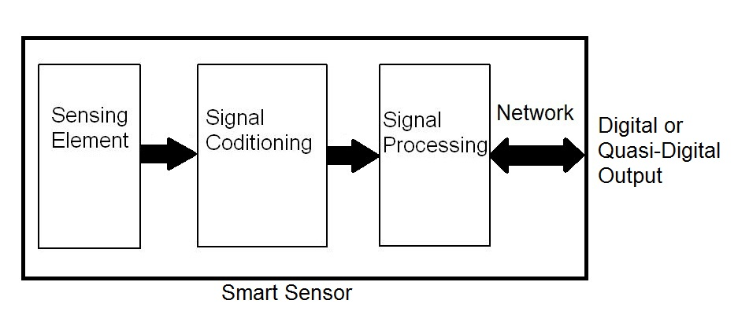

footer: Kenji Rikitake / oueees 201606 part 1 14-JUN-2016
slidenumbers: true

# oueees-201606 Part 1: IoT device technologies

<!-- Use Deckset 1.4, Next theme, 4:3 aspect ratio -->

---

# Kenji Rikitake

14-JUN-2016
School of Engineering Science
Osaka University
Toyonaka, Osaka, Japan
@jj1bdx

---

# Lecture notes on GitHub

* [https://github.com/jj1bdx/oueees-201606-public/](https://github.com/jj1bdx/oueees-201606-public/)
* Don't forget to *check out the issues*!

---

# IoT = electronics

---

# Trends in IoT devices

* They are *computers*
* Small, less physical constraints
* Less power, voltage, and heat
* Driven by *software*

---

# Legacy parts


---


# Traditional PC

* Motherboard[^1]
* CPU
* Memory
* "Peripherals"
* Video
* Extension bus

[^1]: [Diagram by Moxfyre](https://commons.wikimedia.org/wiki/File:Motherboard_diagram.svg), [CC BY-SA-3.0](http://creativecommons.org/licenses/by-sa/3.0/)

<!-- <a href="//en.wikipedia.org/wiki/User:Moxfyre" class="extiw" title="wikipedia:User:Moxfyre">Moxfyre</a> at <a href="//en.wikipedia.org/wiki/" class="extiw" title="wikipedia:">English Wikipedia</a> [<a href="http://www.gnu.org/copyleft/fdl.html">GFDL</a>, <a href="http://creativecommons.org/licenses/by-sa/3.0/">CC-BY-SA-3.0</a>, <a href="http://www.gnu.org/copyleft/fdl.html">GFDL</a> or <a href="http://creativecommons.org/licenses/by-sa/2.5-2.0-1.0">CC BY-SA 2.5-2.0-1.0</a>], <a href="https://commons.wikimedia.org/wiki/File%3AMotherboard_diagram.svg">via Wikimedia Commons</a> -->

---


<!-- By Julianprescott2604juuly (Own work) [<a href="http://creativecommons.org/licenses/by-sa/4.0">CC BY-SA 4.0</a>], <a href="https://commons.wikimedia.org/wiki/File%3AIntel_D945GCPE_Board.JPG">via Wikimedia Commons</a> -->

---

# Computers for IoT: microcontrollers

* All in one board or chip
* CPU + ROM + RAM
* GPIO (Digital I/O)
* Analog interface (A/D, D/A)
* Communications (USB, Serial, SPI, I2C)
* Ethernet / WiFi / Bluetooth

---

# Legacy CPUs .vs. microcontrollers

* Power consumption/management
* Built-in I/O interfaces
* Virtualization and memory protection
* Operating environment
* *Microcontrollers are catching up very fast*

---

# Raspberry Pi

Rasberry Pi 3 Model B


<!-- By Efa2 (Own work) [<a href="http://creativecommons.org/licenses/by-sa/4.0">CC BY-SA 4.0</a>], <a href="https://commons.wikimedia.org/wiki/File%3ARaspberry_Pi_B%2B_rev_1.2.svg">via Wikimedia Commons</a> -->

---


<!-- By Herbfargus (Own work) [<a href="http://creativecommons.org/licenses/by-sa/4.0">CC BY-SA 4.0</a>], <a href="https://commons.wikimedia.org/wiki/File%3ARaspberry_Pi_3_Model_B.png">via Wikimedia Commons</a> -->

---

# Design and implementation of IoT products

---

# Prototyping

* Using breadboards
* No-solder wiring
* Easy but *unstable*
* Many startup projects haven't got further than this phase
* *Not* production-ready

---


<!-- Photo by oomlout [CC BY-SA 2.0](http://creativecommons.org/licenses/by-sa/2.0), [via Wikimedia Commons](https://commons.wikimedia.org/wiki/File%3ABreadboard_Arduino_BBAC_-_Step_2_Programming_with_a_Duemilanove.jpg) -->

---

# Building actual products

* Soldering surface-mount chips and parts
* Making *small as possible*
* Factory built
* Minimalize the features
* Physically and electronically stable
* Legally approved (FCC/UL, CE, PSE)

---


<!-- Photo by Bobricius (Own work) [CC BY-SA 3.0](http://creativecommons.org/licenses/by-sa/3.0), [via Wikimedia Commons](https://commons.wikimedia.org/wiki/File%3APicoduino_size_demonstration.png) -->

---

# Other issues

* Mechanical alignment and stability
* Long-term reliability
* Product life cycle determination
* Vulnerability assessment
* Security and privacy
* Legal liability

---

# Real-world interface: sensors

---

# What are sensors?

Converting environmental changes into information output



<!-- By Tejashs (Own work) [<a href="http://creativecommons.org/licenses/by-sa/3.0">CC BY-SA 3.0</a>], <a href="https://commons.wikimedia.org/wiki/File%3ASmart_sensors.jpg">via Wikimedia Commons</a> -->

---

# Example: mechanical sensors

* Mechanical switches
* Piezoresistivity
* Piezoelectricity 
* Capacitive change
* Inductive change

---

# Application of mechanical sensors

* Accelerometer
* Anemometer (wind speed)
* Gyroscope
* Pressure sensor
* Strain gauge

---

# Non-contact sensors

* Antenna (electromagnetic / radiowave)
* Geiger-Müller tube (radioactivity)
* Microphone (sound / vibration)
* Photodiode (CCD/CMOS image sensors)
* Thermistor (temperature)

---

# Passive or active

* Passive sensors
   - stealth
   - taking energy from the object
* Active sensors
   - detectable
   - dynamic measurement methods

---

# How microcontrollers help sensors

* Digital signal processing
   - Calibration
   - Measurement accuracy
   - Noise reduction
* Failure detection    
* Storage

---

# Role of sensors on IoT technology: collectivity

Extracting hidden characteristics from the massively collected data

* Correlation analysis
* Geographically different points
* Multiple types of information
* Time series analysis

---

# Question: what kind of new sensor devices will emerge?

Think about the following aspects:

* Collective nature of IoT
* Microcontrollers and sensors
* Anything can be a sensor device

---

### Appendix: Wikimedia Commons credits for photos


```markdown
<https://commons.wikimedia.org/wiki/File%3AMotherboard_diagram.svg>
<https://commons.wikimedia.org/wiki/File%3AIntel_D945GCPE_Board.JPG>
<https://commons.wikimedia.org/wiki/File%3ARaspberry_Pi_B%2B_rev_1.2.svg>
<https://commons.wikimedia.org/wiki/File%3ARaspberry_Pi_3_Model_B.png>
<https://commons.wikimedia.org/wiki/File%3ABreadboard_Arduino_BBAC_-_Step_2_Programming_with_a_Duemilanove.jpg>
<https://commons.wikimedia.org/wiki/File%3APicoduino_size_demonstration.png>
<https://commons.wikimedia.org/wiki/File%3ASmart_sensors.jpg>

(All licensed CC BY-SA)
```
