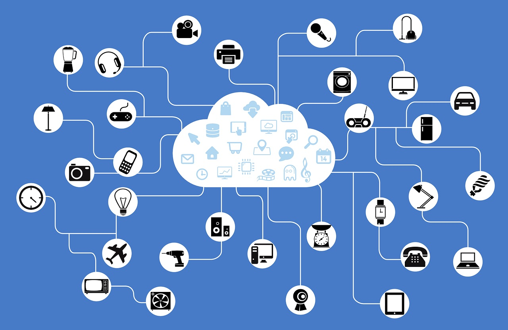
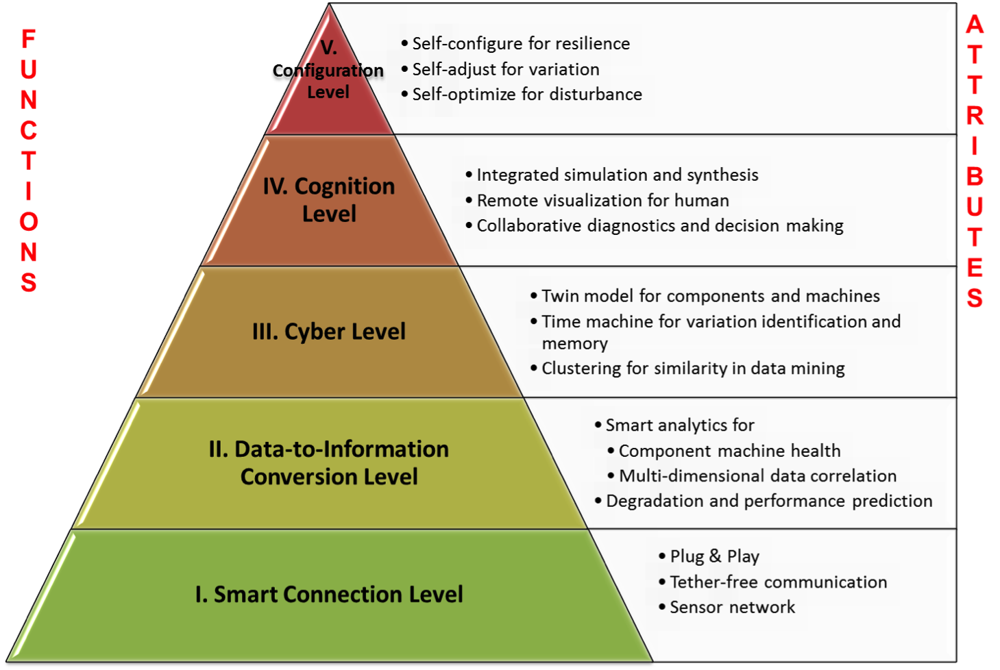
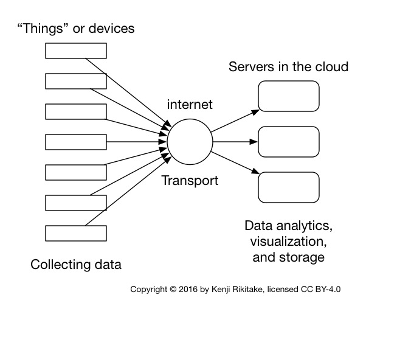
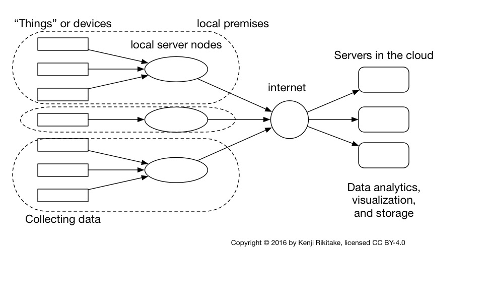
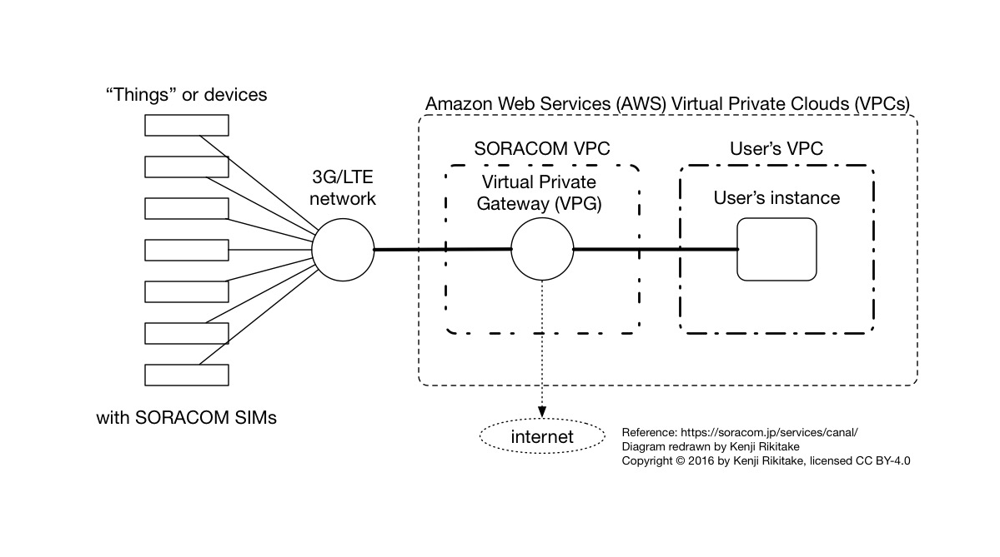
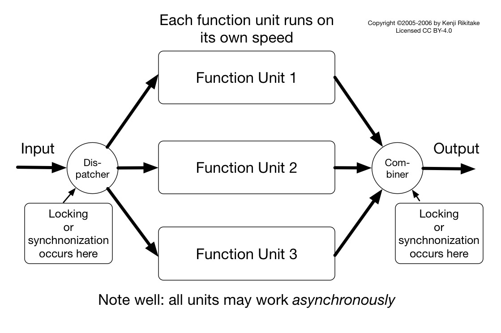
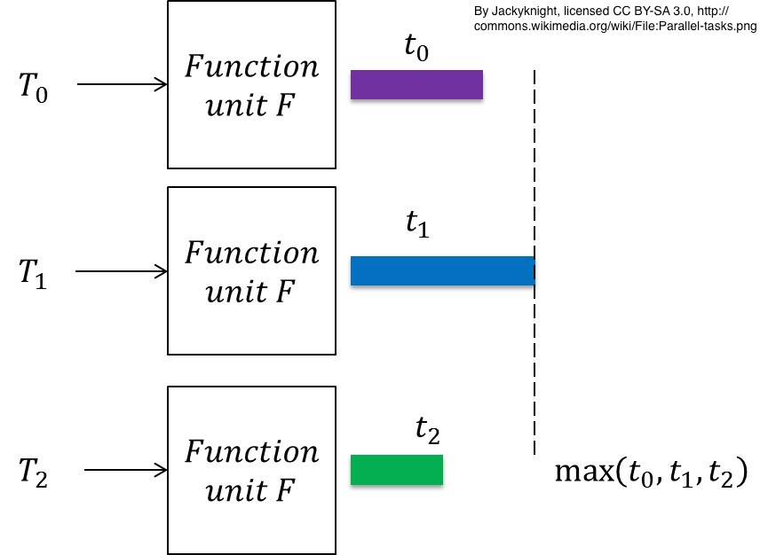

autoscale: true
footer: Kenji Rikitake / oueees 201606 part 2 21-JUN-2016
slidenumbers: true

# oueees-201606 Part 2: IoT software and infrastructure

<!-- Use Deckset 1.4, Next theme, 4:3 aspect ratio -->

---

# Kenji Rikitake

21-JUN-2016
School of Engineering Science
Osaka University
Toyonaka, Osaka, Japan
@jj1bdx

---

# Lecture notes on GitHub

* [https://github.com/jj1bdx/oueees-201606-public/](https://github.com/jj1bdx/oueees-201606-public/)
* Don't forget to *check out the issues*!

---

# What Internet of Things is all about?

---

# Things.

---

# Internet (supposed to be)

---

# Trivia: IoT is also called M2M (Machine to Machine)

---

# M2M technology

* Direct communication between devices
* IoT is modern M2M
* Links: PSTN, GSM/3G/LTE, internet, Wifi, bluetooth, LoRa (low-power WAN), etc.
* *Not necessarily* centralized

---

# Cyber-physical systems[^1]

[^1]: By Behrad3d/IMSCenter.net, <http://imscenter.net/cyber-physical-platform>

---

# OTOH current IoT model: for telemetering = data collection

---

# Telemetering

---

# So, the reality is:

* Mostly unidirectional (not really *the true and genuine internet*)
* Sensors/devices gathering data through internet and feed them to the servers in the cloud computing platforms
* *The servers do the most of computation*
* **Extremely centralized**

---

# Things need local servers

---

---

# Why local server nodes?

* Microcontrollers do not speak internet
* TCP/IP, HTTP, MQTT and other protocols are simply *too complex*
* Local servers give more computing power
* Devices to servers: serial over USB, SPI, I2C
* Local servers to internet: HTTP, MQTT, UDP
* ... with cryptographic security (TLS)

---

# Reality: nobody wants to think about the security (and privacy)

---

# Secure operation is hard

* Access control: filesystems, networks, etc.
* Authentication: identity management
* Cryptography: computationally security consumes a lot of CPU power
* Logging and backup
* Physical tampering: TEMPEST (electromagnetic emission), wiretapping, **device theft**

---

# More reality: security incidents may risk your business and trust

---

# So what is "IoT security"?

* Nothing special: no silver bullet exists
* 20 years ago in 1995, it was called **private network**; and now it is called **VPN** (virtual private network)
* How to connect non-intelligent devices without worrying much about security
* Closed networks built over internet
* Question: *is it really secure*?

---

# Security with 3G/LTE example: SORACOM Canal

* Device > 3G/LTE > SORACOM Virtual Private Cloud (VPC) > user's AWS VPC (no internet exposure)
* SIM-based authentication and encryption
* No need to configure VPN
* Access to internet selectable via Virtual Private Gateways (VPGs)
* Public Beta status as of June 2016

---

---

# Other issues on IoT infrastructure systems

* Very large scale database is hard
* Massive connections/packets from devices
* Concurrency/parallelism
* Consistency .vs. availability
* Distributed systems problem
* Fault-tolerance .vs. simplicity

---

### Inconsistency by concurrency/parallelism

---

# Concurrency and timing

---

# Inconsistency by netsplit

---

# IoT device communication

* Data link speed (bits/second)
* Frequency per TCP/UDP/IP packets
* Frequency per transmission events
* Acceptable error rate
* Acceptable power consumption
* ... and many more things to consider

---

# Question: what kind of link technologies will emerge for IoT?

Think about the following points:

* How much energy can a device consume?
* How much bandwidth is required?
* How reliable should the communication be?

---

### Credits for photos and diagrams

* <https://pixabay.com/en/icons-symbols-signs-set-travel-41305/> [[CC0 / public domain](https://creativecommons.org/publicdomain/zero/1.0/)]
* <https://pixabay.com/en/network-iot-internet-of-things-782707/> [[CC0 / public domain](https://creativecommons.org/publicdomain/zero/1.0/)]
* By Behrad3d/[IMSCenter.net](http://imscenter.net/cyber-physical-platform)
[[CC BY-3.0](http://creativecommons.org/licenses/by/3.0/)], via Wikipedia <https://en.wikipedia.org/wiki/File%3ACPS_for_Manufacturing.png>
* By Jackyknight (Own work) [[CC BY-SA 3.0](http://creativecommons.org/licenses/by-sa/3.0)], via Wikimedia Commons <https://commons.wikimedia.org/wiki/File%3AParallel-tasks.png>
* By b4283 (Own work) [[CC0 / public domain](https://creativecommons.org/publicdomain/zero/1.0/)], via Wikimedia Commons <https://commons.wikimedia.org/wiki/File%3ANetsplit_split.svg>
