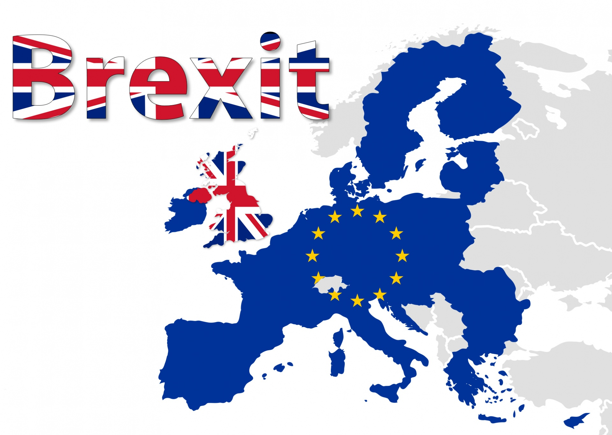
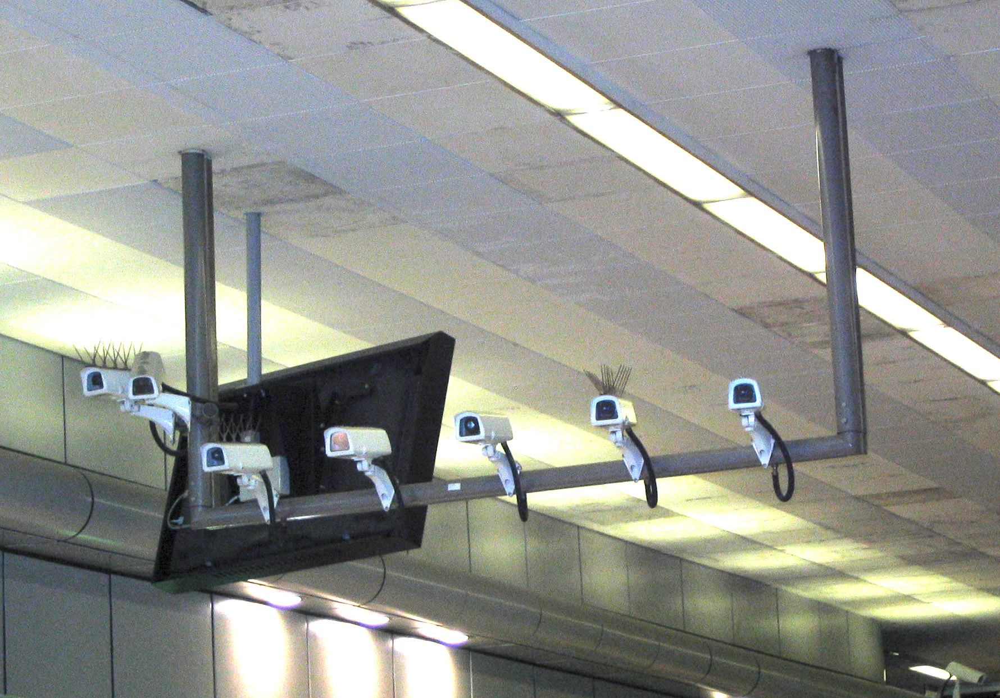
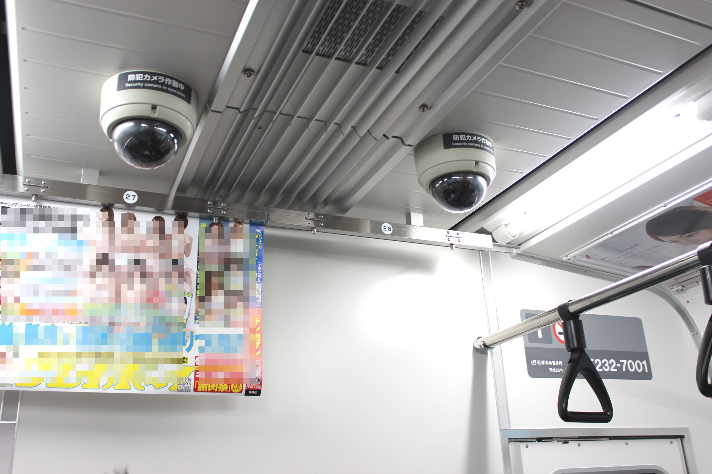
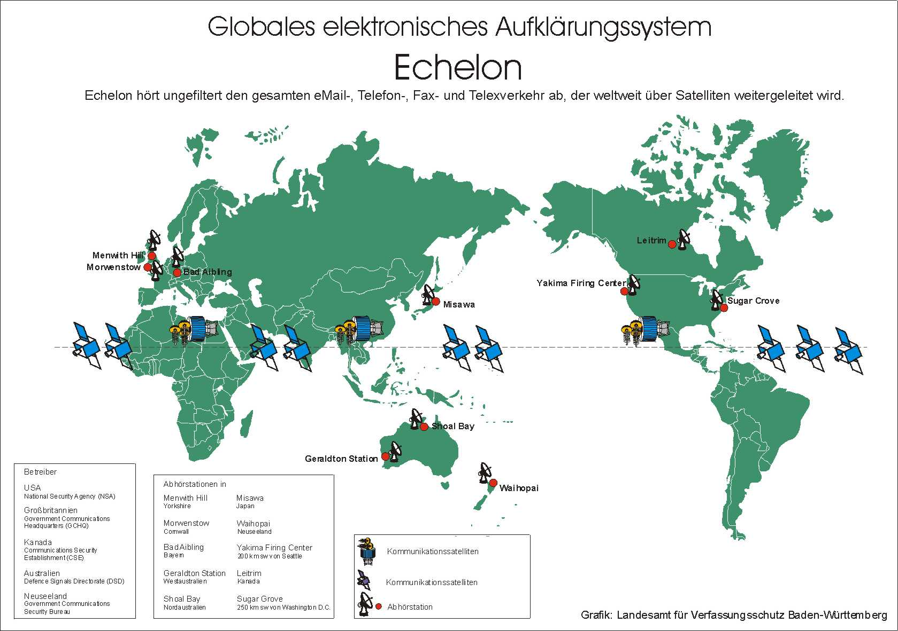
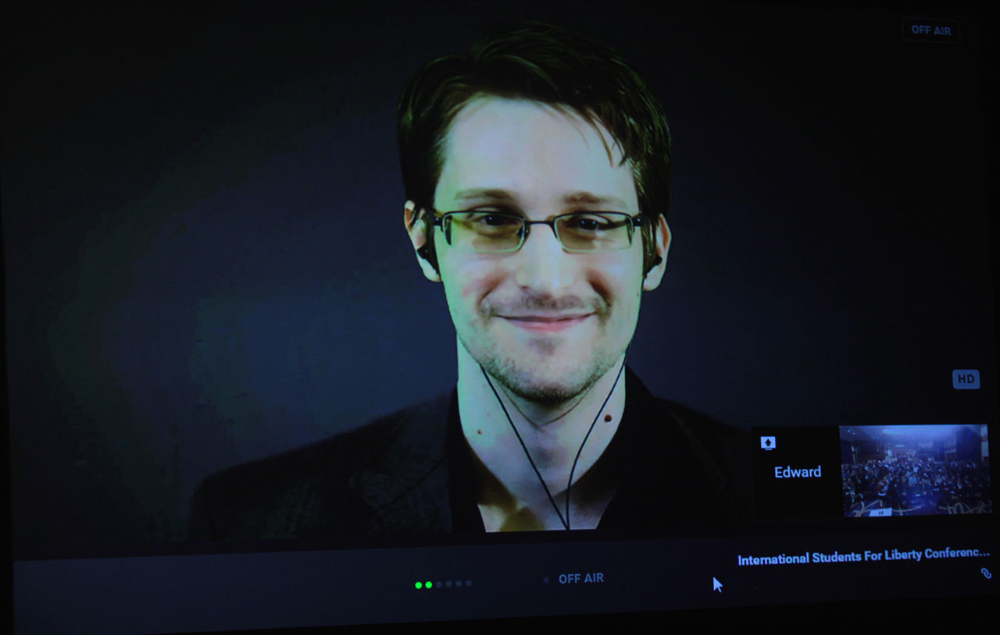
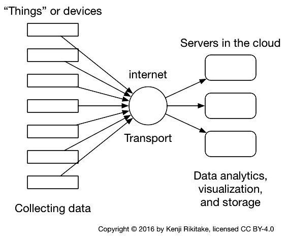
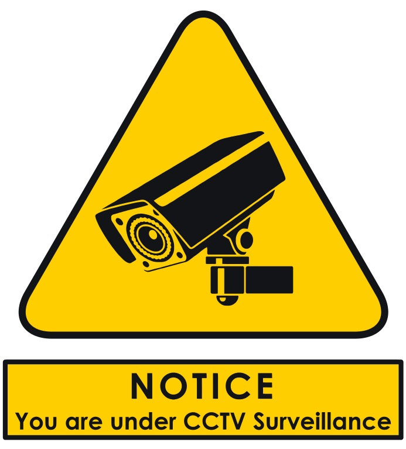

autoscale: true
footer: Kenji Rikitake / oueees 201606 part 3 28-JUN-2016
slidenumbers: true

# oueees-201606 Part 3: IoT security and privacy

<!-- Use Deckset 1.4, Next theme, 4:3 aspect ratio -->

---

# Kenji Rikitake

28-JUN-2016
School of Engineering Science
Osaka University
Toyonaka, Osaka, Japan
@jj1bdx

---

# Lecture notes on GitHub

* [https://github.com/jj1bdx/oueees-201606-public/](https://github.com/jj1bdx/oueees-201606-public/)
* Don't forget to *check out the issues*!

---

# Before the main topics, let's talk about a current issue

---

---

# Brexit's aftermath

* **One more layer of political barriers** 
* *More strict immigration control*
* Hampers Europe's financial, research and academic sectors, based on *free movement of people and ideas*
* May cause backlash on telecom sectors, e.g., mobility across the borders

---

# Why UK matters

* Computers - Alan Turing
* Leading nation of English language
* **Raspberry Pi**
* Extremely sophisticated *surveillance networks*, domestic and worldwide
* Multi-ethnic inside: Wales, Scotland, Northern Ireland, and many immigrants

---

# And why UK really matters?

---

# UK is a *mass surveillance* nation

---

# And Japan is too
## 壁に耳あり 障子に目あり

---

# Mass surveillance

* Government/major organizations watch *all* the members *always*
* Considered as **serious human right abuse**
* An UK example: closed-circuit television (CCTV) = *surveillance cameras* all around the nation (~1.85 million[^1] nationwide in UK)

[^1]: <https://en.wikipedia.org/wiki/Mass_surveillance_in_the_United_Kingdom#Number_of_cameras>

---

### International network of surveillance established since 1971:
# ECHELON
## United States of America
## United Kingdom
## Canada
## Australia
## New Zealand

---

---

### Edward Snowden
### Disclosed NSA documents in 2013

---

# What Snowden revealed

* Global surveillance programs[^2]
   - USA: PRISM
   - UK: MUSCULAR
   - Germany: Project 6
   - France: Lustre
* Major players: US NSA, UK GCHQ
* ... and many ISPs cooperate

[^2]: <https://en.wikipedia.org/wiki/Global_surveillance_disclosures_(2013%E2%80%93present)>

---

---

## More examples of surveillance

* Tracking location (via GPS)
* Secretly recording private conversations
* Secretly recording private videos
* Stealing identities through software
* Activity tracking via the operating systems
* Monitoring cell phone conversations

---

---

## Primary use of IoT = surveillance?

---

## Ethical questions: do you want to be always monitored? Do you want to keep other people under surveillance?

---

### More practical questions:
## Do you really need to monitor?
## Do you really need to know what people are doing?
## Can you convince the monitored people for what you do?

---

# Broader IoT Security: preventing abuse (for surveillance)

---

# Privacy protection

* Access control to prevent accidental revelation of obtained data
* End-to-end cryptography: preventing MITM attacks or wiretapping
* *Not* collecting the data you don't need to know; or even discarding them
* **Data can be used for something completely unintended at the beginning**

---

# You control
# *your data*

---

# Your data is yourself

* Biometrics: fingerprints, blood cells, skin tissues, face, weight, height, retina patterns
* Credit history: back account, credit card payment, CO-OP meal card payment
* Purchasing history: books, music, videos
* Publications: blog, SNS records (*both public and private*), chat conversations

---

# Traffic analysis

* Collective analysis: big data science
* **Targeted analysis: monitoring conversation of specific two or more people**
* **Surveillance**: completely passive, you will never know who chases after you
* **IoT** to analyze personal/private activities

---

# Question: what will happen if IoT becomes pervasive in our world?

Think about the following points:

* How precise your activities will be monitored?
* Can machines *predict* how you will move or act?
* What will the next step from global mass surveillance be? 

---

### Credits for photos and diagrams

* <http://www.publicdomainpictures.net/view-image.php?image=165944&picture=brexit> [[CC0 / public domain](https://creativecommons.org/publicdomain/zero/1.0/)]
* By User Mike1024 (Photographed by User\:Mike1024) [[CC0 / public domain](https://creativecommons.org/publicdomain/zero/1.0/)], via Wikimedia Commons <https://commons.wikimedia.org/wiki/File:Security_cameras_7_count_birmingham_new_street_station.jpg>
* By Rsa (Own work) [[GFDL](http://www.gnu.org/copyleft/fdl.html) or [CC-BY-SA-3.0](http://creativecommons.org/licenses/by-sa/3.0/)], via Wikimedia Commons <https://commons.wikimedia.org/wiki/File:JR_East_E232-7001_surveillance_camera.jpg>
* <https://en.wikipedia.org/wiki/File:LfV_BW_1998_Echelon.jpg> [[CC0 / public domain](https://creativecommons.org/publicdomain/zero/1.0/)]
* By Gage Skidmore [[CC BY-SA 2.0](http://creativecommons.org/licenses/by-sa/2.0)], via Wikimedia Commons <https://commons.wikimedia.org/wiki/File%3AEdward_Snowden_Conference_2015.jpg>
* <https://en.wikipedia.org/wiki/File:NSA_Muscular_Google_Cloud.jpg> [[CC0 / public domain](https://creativecommons.org/publicdomain/zero/1.0/)]
* By [User:Amityadav](https://commons.wikimedia.org/w/index.php?title=User:Amityadav8) [[CC BY-SA 3.0](http://creativecommons.org/licenses/by-sa/3.0)], via Wikimedia Commons <https://commons.wikimedia.org/wiki/File%3ACCTV_Surveillance_Notice.svg>

